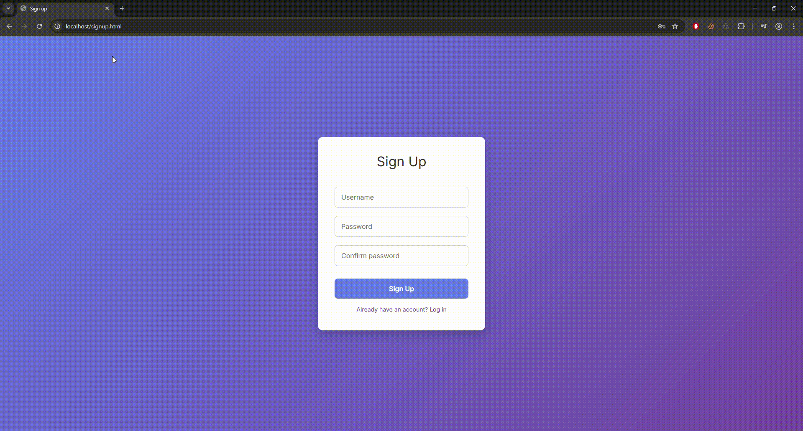
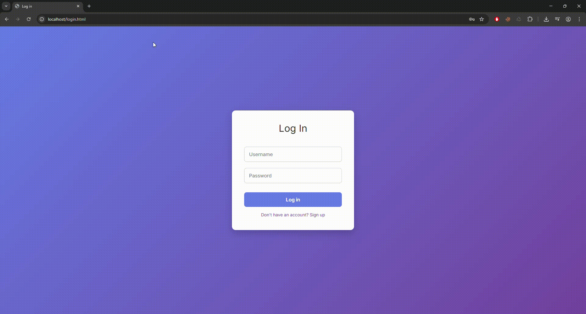

# Secure auth with NodeJS
> Login and registration system with TOTP (Time-based One-Time Password), password hashing using bcrypt, and some basic server-side validation.

## Features
- Hash the password with bcrypt before saving it to the database.
- Server-side checks: alphanumeric character validation for the username, minimum and maximum length checks for both password and username, check if the username is already registered, and a maximum attempt limit for entering the OTP code.
- Handling of pending login requests awaiting OTP code verification, with expiration after 5 minutes.
- Client-side QR code generation to easily add the secret key to your authentication app (e.g. Google Authenticator).
- Simple use of JSON to send and receive requests, with realistic status codes for responses.
- Use SQL parameters to prevent SQL injection.

## How to use
### Install the dependencies
```bash
# Run the command inside the API/ folder
npm install
```
### Start the backend server
```bash
# Run the command inside the API/ folder
node server.js
```
> Make sure the HTML files are served from a server (hosted) and not opened directly as local files, because the login stores the pending login request ID in cookies, which won’t work if you open the file locally.

I hope this helps you learn how a robust login and signup system works. Have fun experimenting and modifying my code by adding extra features, for example, a token-based system after the user logs in.

### Sign up phase


### Log in phase

